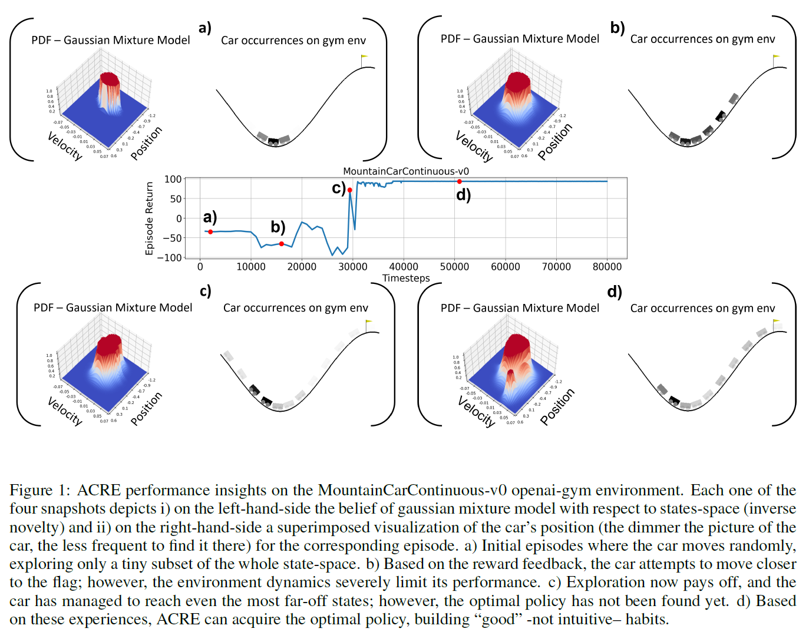

# ACRE: Actor-Critic with Reward-Preserving Exploration

ACRE is a model-free, off-policy RL algorithm specifically designed to incorporate **extra exploration signals without blurring the environmental rewards**. 





Installation 
------------
###### [Tested with **python 3.7** and **Ubuntu 18.04** & **20.04**]

1. Install ubuntu needed libraries
```
sudo apt install libpython3.7-dev
sudo apt install libopenmpi-dev
```
2. Install MuJoCo (Optional)

   If you want to use the [MuJoCo](https://mujoco.org/) environments you must follow [readme instructions](https://github.com/openai/mujoco-py/blob/master/README.md) to install mujoco-py

3. Clone this repository
```
git clone https://github.com/athakapo/ACRE.git
``` 
4. Enter project's repository and create a new python environment of your choice. Here we provide a `venv` example, however the installation instructions using `conda` environment is pretty similar.
```
cd ACRE
python3.7 -m venv venv
``` 
5. Activate the environment
```
. venv/bin/activate
```
6. Install the needed dependencies*
```
python -m pip install -r requirements.txt
```
> *If you encounter any problem in the installation of **mpi4py**, please check this [quide](https://mpi4py.readthedocs.io/en/stable/install.html):
   Probably you need to find your current path to mpicc (sudo find / -name mpicc) and then run:
   `
   env MPICC=path_to_mpicc/mpicc python -m pip install mpi4py==3.0.3
   `

Example Usage
------------
1. Open up `terminal`, navigate to project's repository and activate python environment
```
. venv/bin/activate
```
2. Add `[ACRE]` project into your `PYTHONPATH`
```
export PYTHONPATH="$PWD"
```
3. Execute a python scrypt
   1. **[1<sup>rst</sup> Example]** Run ACRE algorithm for `MountainCarContinuous-v0` environment
      ```
      python algos/acre/acre.py --env MountainCarContinuous-v0
      ```
   2. **[2<sup>nd</sup> Example]** After defining the values in run_experiment_grid.py execute
      ```
      python run_experiment_grid.py
      ```
4. Monitor learning progress through [Tensorboard](https://www.tensorflow.org/tensorboard)*
###### *execute this command after having started the training script (Step 3)
```
tensorboard --logdir tensorboard/
```


Project Structure
------------
Following [Spinning Up](https://spinningup.openai.com/en/latest/) nomenclature:

    ├── README.md                       <- You are here!
    ├── algos                           <- All supported RL algorithms
    │   ├── acre                        <- ACRE folder
    │   │   ├── acre.py                 <- Algorithm logic and learning process
    │   │   ├── acre_MountainCarContinuous-v0.py <- Saved ACRE parameters for MountainCarContinuous-v0 environment
    │   │   ├── acre_Swimmer-v2.py      <- Saved ACRE parameters for Swimmer-v2 environment
    │   │   └── core.py                 <- Neural networks definitions and varius ACRE utilities
    │   ├── ddpg                        <- DDPG https://arxiv.org/abs/1509.02971
    │   ├── ppo                         <- PPO https://arxiv.org/abs/1707.06347
    │   ├── sac                         <- SAC https://arxiv.org/abs/1801.01290    
    │   └── td3                         <- TD3 https://arxiv.org/abs/1802.09477
    │
    ├── data                            <- Data folder for each algorithm to save checkpoints 
    |                                      and reproduce experiments
    │
    ├── images                          <- Generated graphics and figures for the repository README
    │
    ├── tensorboard                     <- Monitor the progress of learning curves in real-time
    │                                      with the power of tensorboard
    │
    ├── utils                           <- Collection of several supplementary utilities
    │   ├── gmm.py                      <- Gaussian Mixture Model definition and functionality
    │   ├── logx.py                     <- A general-purpose logger
    │   ├── ModifiedTensorBoard.py      <- Tensorboard
    │   ├── mpi_pytorch.py              <- Data-parallel PyTorch optimization across MPI processes
    │   ├── mpi_tools.py                <- MPI tools
    │   ├── run_utils.py                <- Utilities for running experiments
    │   └── serialization_utils.py      <- Serialization utilities
    │
    ├── run_experiment_grid.py          <- Run the same algorithm with many possible hyperparameters
    ├── requirements.txt                <- The requirements file for reproducing the python environment

Simulation results
------------
ACRE algorithm was evaluated on **12 continuous control tasks** from the most well-known and used, openai-gym-style collections, using [Tonic RL library](https://github.com/fabiopardo/tonic). The evaluation was grouped into 3 bundles:

1. Standard [openai-gym control](https://gym.openai.com/) tasks
   1. *BipedalWalker-v3*
   2. *LunarLanderContinuous-v2*
   3. *MountainCarContinuous-v0*
   4. *Pendulum-v0*
2. Advanced physics' simulator of [MuJoCo](https://mujoco.org/) environments
   1. *Ant-v3*
   2. *Hopper-v3*
   3. *Swimmer-v3*
   4. *Walker2d-v3*
3. [DeepMind Control Suite](https://deepmind.com/research/open-source/deepmind-control-suite) 
   1. *ball_in_cup-catch*
   2. *cartpole-two_poles*
   3. *finger-turn_easy*
   4. *quadruped-walk*

The performance of ACRE in comparison with [A2C](https://arxiv.org/abs/1602.01783), [DDPG](https://arxiv.org/abs/1509.02971), [PPO](https://arxiv.org/abs/1707.06347), [SAC](https://arxiv.org/abs/1801.01290), [TD3](https://arxiv.org/abs/1802.09477) and [TRPO](https://arxiv.org/abs/1502.05477) is illustrated in the following figure:


Contributing
------------
Contributions, issues and feature requests are welcome!
Feel free to use [issues page](https://github.com/athakapo/ACRE/issues).


Cite as
------------
```
to be announced
```

